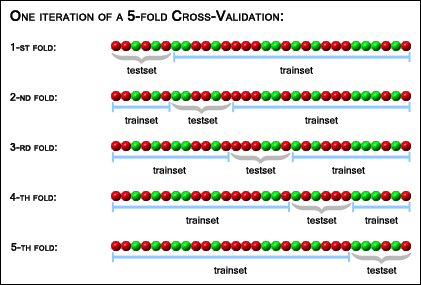

# Introduction

Model selection is inherent to the statistician work which aims to explain the observed data. According to a model, we want to infer the impact of different factors (estimate parameters and their variances) on the variable of interest. This impact should be evaluated differently according to the aim of the model.

From a predictive point of view, we want to reproduce the data generating process, i.e. we define a model which aims to best predict the **response variable** of future observations according **predictor variables**.
We consider that it is not possible to develop a model which is similar the "nature"/"reality", but we try to approximate it. So, we try to define a model which well reproduce the data generating process. With this assumption, we know that the model is wrong, so the parameters cannot be interpreted as the true relation between the response and predictors. So, without care of interpretability, we consider only the **predictors** which contribute significantly to predictive performance and remove the others, even if they are known risk factors (e.g. if the age does not contribute to predictive performance, we remove it from the model, even if it is known as risk factor). Moreover, without care of interpretability, we can use very flexible models (e.g. splines,...) which are too complex for human interpretation. That's the domain of "data science" where the deep learning methods, random forest and others very complex methods are daily used, at the risk of overfitting, i.e. the model becomes too sensible to the sample and cannot be generalized to an other (future) sample, decreasing the predictive performance. The "small" sample size and the need of interpretability in health studies prevent the use of these methods.

In health study, we can find several **predictive risk scores** developed with intermediate strategy. The model is developed according to a predictive criterion, but known risk factors are forced for interpretability. Beyond interpretability, some factors are forced for practical considerations: if a risk model with age only has an AUC (see next notebook on predictive models) of 0.75 and a model using only the expression of 3 genes has an AUC of 0.77, the model with age only will be considered because the difference of prediction accuracy lead to non-significant benefit (in term of clinical point of view, not statistical point of view), regarding to the consequence of the price of systematic sequencing.

In this notebook, we will describe the strategy of the development of explanatory model (see expModSelec_notebook.Rmd notebook).


# Predictive modeling

Predictive modeling strategy is different from the explanatory strategy:

- Obtain the best fit (according to the maximum likelihood) to the data is not a good thing (risk of overfitting, low generalizability to other data)
- The parcimony in predictive modeling required to limit overfitting favors simple models. Variables providing redundant information compared to other better predictor (e.g. confounding factors) will be removed during model selection, limiting interpretability
- If we consider that all models are wrong, the assumptions of the relationship between variables are ill-posed. Therefore, the model development does not rely on assumption testing (so, no test and p-value, no interpretation of coefficient in term of variable relationship), but on predictive criteria


## Different Types of Risk Prediction Models

Risk prediction models can focus on a wide variety of clinical outcomes. We discern diagnostic, prognostic, and treatment effect prediction models:

- Diagnostic prediction models estimate the probability that a patient has an event or disease at the time of examination, ex: for example, whether a tumor is benign or malignant in order to decide how to manage the patient.
- Prognostic models estimate the risk that a clinically relevant endpoint will happen in the future, ex: prognostic risk prediction models may aim to predict the development of the disease in order to assist clinicians with therapeutic decision-making.
- Treatment effect models estimate the probability of a clinically relevant outcome conditional on having received particular treatments, ex: treatment allocation in precision medicine

In this document, we will focus on the development of a prognostic model using the *flchain* dataset of the *survAUC* package.
```{r echo=FALSE}
library(survAUC)
```


## Model complexity: Underfitting & overfitting

The main assumption is that the observations are generating by a process with noise:

```{r echo=FALSE}
X<-seq(-3,3,0.1)
Y<-sin(X)+rnorm(length(X))
fitLm<-lm(Y~X)
plot(X,Y)
lines(X,sin(X),col=2)
legend("topleft",c("Observations","Data generating process"),lty=c(NA,1),pch=c(1,NA),col=1:222,bty="n")
```


When we define a model, we can favor simple model for interpretability (ex: linear regression), or complex model (ex: spline) to approximate the complex data generating process.


```{r echo=FALSE}
X<-seq(-3,3,0.1)
Y<-sin(X)+rnorm(length(X))
fitLm<-lm(Y~X)
plot(X,Y)
lines(X,sin(X),col=2)
lines(X,coef(fitLm)[1]+coef(fitLm)[2]*X,col=3)
lines(X,Y,col=4)
lines(lowess(Y~X,f=2/5),col=5)
legend("topleft",c("Observations","Data generating process","Under-fitting","Over-fitting","Good fit"),lty=c(NA,1,1,1,1),pch=c(1,NA,NA,NA,NA),col=1:5,bty="n")
```

From new observations, the data will have the same trend, but the point will not be to the same location due to the random noise. The goal of predictive model is to develop a model which is enough flexible to approximate the process which generate the data, but not too flexible to be robust to the random noise.

### Underfitting


Underfitted model will not vary much with the random noise. It will be robust to the noise:

```{r echo=FALSE}
plot(X,sin(X),type="l",col=2)
for(i in 1:20){
  set.seed(i)
  Y<-sin(X)+rnorm(length(X))
  fitLm<-lm(Y~X)
  lines(X,coef(fitLm)[1]+coef(fitLm)[2]*X)
}
```

But the data generative process trend is not captured and the bias (relative to the data) is large. It will have poor prediction performance to (current and new) data.

### Overfitting

Overfitted model will vary a lot with the random noise:

```{r echo=FALSE}
plot(X,sin(X),type="l",col=2,lwd=3)
for(i in 1:20){
  set.seed(i)
  Y<-sin(X)+rnorm(length(X))
  lines(X,Y)
}
```

The bias to the data is really low, but the model change for each new data. It is clear that one model fitted on one data will provide very poor prediction for a new data.


### Bias-variance trade-off

Due to the random noise, the data generating process as a bias (relatively to observation) but is invariant. The aim of predictive modeling is to have a model with a good bias-variance trade-off:

```{r echo=FALSE}
plot(X,sin(X),type="l",col=2,lwd=3)
for(i in 1:20){
  set.seed(i)
  Y<-sin(X)+rnorm(length(X))
  lines(lowess(Y~X,f=2/5))
}
```

This model is clearly more robust to the random noise than the overfitted model, but less than the underfitted model. On the other hand, its bias is lower than the underfitted model but larger than the overfitted model. This compromise provides better predictive performance.


# Model development strategy

The model complexity should be regulated according to a predictive criterion to find this best compromise. The common way is to compare the difference between the prediction of the model and the observed data. 

As this difference is null for overfitted model, the databases for the **training** of the model and its **test** (evaluation of the difference between the predictions and observations) should be different. The best option is to develop the model on a dataset (a part used as **training set** and another for **test set**) and have an external dataset (= **validation** set, similar population but not coming from the same study) to quantify the generalizability of the model to new data set.

The main idea is to train the models on different data than the one on which they are compared

## Remove a priori useless predictors

Such as explanatory strategy, removing a prior known variable which are not predictor is useful do decrease the noise in the starting model.

## Internal validation

The first strategy is to compare the candidate models on our dataset. The data is split in a **training set** to train the models and compare them on a **test set**.

### Hold-out

The hold-out strategy consists of randomly hold out a part of the data set (usually ~20%), develop the models on the remaining part of the original dataset, and validate them on the held-out part dataset (**test set**).

Let's try with the *flchain* data set:

```{r}
set.seed(1) #As this procedure depends on random number generation, define the seed at the begining of the code to ensure that you can reproduce the results
idx<-sample(1:nrow(flchain),nrow(flchain)) #mix the data line indexes
nbHoldOut<-round(0.2*nrow(flchain))
idxTest<-idx[1:nbHoldOut] #hold out the first 20% 
idxTrain<-idx[(nbHoldOut+1):length(idx)] #get the remaining 80% as training set
testSet<-flchain[idxTest,]
trainSet<-flchain[idxTrain,]
```

The limitations of this approach are:

- Only a part of the data set is used, decreasing the available information to develop the model
- The results are highly dependent on the specific draw that was used (especially for small sample size), leading to unstable development: Different draws risk to produce different results (non-reproducible results), especially if you are unlucky and that the held out part include a lot of extreme values.


### Cross-validation (CV)

The cross-validation procedure allows to use the complete dataset information for model development using sequentially different part of the data as training set and as test set. The figure below illustrate this procedure:


(source http://genome.tugraz.at/proclassify/help/pages/XV.html)

The data is randomly splitted in k sub-samples (usually 5 or 10). Sequentially, each sub-sample is held out, the models are developed using the others sub-samples and compared on the held out sub-samples. For each "fold", the predictive performance criterion is saved, and the models are compared on their mean predictive performance criterion across the folds.

This limits the influence of specific held out dataset. To improve robustness to sampling, this procedure may be repeated several times (ex: repeat 10 times a 5-folds CV will allows to define different sub-samples), and the performances are averaged across all folds of all the repetition. This is however more computationally intensive.

If your dataset is still structured (ex: in the case of multicenter study), using the different unit (ex: center) to define sub-sample (instead random sampling) may produce more reliable results because each test dataset is an external dataset, limiting the selection of an overfitted model.

Let's program a 5 fold CV with the **flchain** dataset:

```{r}
set.seed(1)
K<-5 #number of fold
idx<-rep(1:K,ceiling(nrow(flchain)/K)) #generate a vector with K indicators (1 to 5) repeated the number of lines of flchain / K (to have approximatelly a vector of the length equal to the number of row of flchain, ceiling() is for round nrow(flchain)/K to the above integer, to ensure that the size of idx will be at least > nrow(flchain) )
idx<-idx[1:nrow(flchain)] #keep only the number of idx elements equal to the number of row of flchain
table(idx) #check that we have approximatively the same number of each indicator
idx<-sample(idx) #mix the indicators
#CV
for(k in 1:K){
	trainSet<-flchain[idx!=k,]
	testSet<-flchain[idx==k,]
}
```


### Leave-one-out cross-validation (LOO CV)

This is the extreme case of the CV, holding out sequentially each observation. Even if it can lead to better model selection than CV, the computational burden is clearly higher, and not tractable for dataset with thousands of observations and complex models.

Let's do this with the flchain dataset:

```{r}
for(i in 1:nrow(flchain)){
	trainSet<-flchain[-i,]
	testSet<-flchain[i,]
}
```


### Akaike information criterion and cross-validation 

The Akaike information criterion (AIC) penalizes the models with high number of parameters:
$$
AIC=-2 \log L +2p
$$
With $L$ the likelihood and $p$ the number of model parameters.

Stone (1977) shows that it is asymptotically equivalent to the LOO CV using the log-likelihood as performance criterion. It is thus appealing to use it when the LOO CV is too computationally intensive, ex: big dataset or model with time consuming optimization (numerical integration, MCMC,...).

However, this equivalence is asymptotic, thus AIC and LOO CV do not systematically provide the same results for relatively small sample size. When the selected model differ with these two strategies, LOO CV id more robust and should be favored.


## External validation

The internal validation allows to develop the model. However, as the training and test sets coming from the same population which can be specific (due to study inclusion criteria), the predictive performance may be slightly optimistic and it is necessary to evaluate the final model predictive performance using an other dataset (external dataset) which will be slightly different from the initial dataset.


## Predictive performance criteria

### Discrimination

For survival outcome, the difficulty is to take into account the "missing data" due to the censoring. Several criteria were developed. The older is the C-index of Harrell, which is sensible to the censoring variable. The Uno's concordance is more robust to censoring. The Uno's area under the curve is often consider (Higher value is better). Another popular criterion is the Brier score (lower is better), which take into account discrimination, but also calibration.

Let's compare the Brier score and Uno's AUC for the prediction or risk at time 3000, for 4 different Cox models using 5-folds CV:


```{r}
library(survAUC)
K<-10
stockBS<-matrix(NA,nrow=K,ncol=4) #vector to stock the Brier score for each of the K folds for the 4 candidate models
stockUC<-matrix(NA,nrow=K,ncol=4) #vector to stock the Uno concordance for each of the K folds for the 4 candidate models
colnames(stockBS)<-colnames(stockUC)<-paste0("Model",1:4)
idx<-rep(1:K,ceiling(nrow(flchain)/K))
idx<-idx[1:nrow(flchain)]
set.seed(1)
idx<-sample(idx)
for(k in 1:K){
	trainSet<-flchain[idx!=k,]
	testSet<-flchain[idx==k,]
	surv.train<-Surv(trainSet$futime,trainSet$death)
	surv.test<-Surv(testSet$futime,testSet$death)
	#Train the 4 models
	fit1<-coxph(Surv(futime,death)~age,data=trainSet)
	fit2<-coxph(Surv(futime,death)~age+sex,data=trainSet)
	fit3<-coxph(Surv(futime,death)~age+sex+kappa+lambda,data=trainSet)
	fit4<-coxph(Surv(futime,death)~sex+kappa+lambda+age:sex+sex:kappa+age:lambda,data=trainSet)
	#Compute and stock the Brier scores
	stockBS[k,1]<- predErr(surv.train,surv.test,predict(fit1), predict(fit1,newdata=testSet), times=3000,type = "brier")$error
	stockBS[k,2]<- predErr(surv.train,surv.test,predict(fit2), predict(fit2,newdata=testSet), times=3000,type = "brier")$error
	stockBS[k,3]<- predErr(surv.train,surv.test,predict(fit3), predict(fit3,newdata=testSet), times=3000,type = "brier")$error
	stockBS[k,4]<- predErr(surv.train,surv.test,predict(fit4), predict(fit4,newdata=testSet), times=3000,type = "brier")$error
	#Compute and stock the Uno's AUC
	stockUC[k,1]<-AUC.uno(surv.train,surv.test,predict(fit1), times=3000)$auc
	stockUC[k,2]<-AUC.uno(surv.train,surv.test,predict(fit2), times=3000)$auc
	stockUC[k,3]<-AUC.uno(surv.train,surv.test,predict(fit3), times=3000)$auc
	stockUC[k,4]<-AUC.uno(surv.train,surv.test,predict(fit4), times=3000)$auc
}
print("Mean Brier score:")
apply(stockBS,2,mean)
print("Mean Uno's AUC:")
apply(stockUC,2,mean)


```

According to the Uno's AUC, the model 2 is the best. According to the Brier score, the model 4 is slightly better than the other. The criteria are thus not concordant for the model choice. But these means of criteria are estimators. For consistent comparison of these estimators, we can estimate their empirical distribution with bootstrap (resampling data with replacement) and provide 95% confidence intervals.


```{r}
K<-5
nBoot<-100
stockMeanBS<-matrix(NA,nrow=nBoot,ncol=4) #vector to stock the Brier score for each of the K folds for the 4 candidate models
stockMeanUC<-matrix(NA,nrow=nBoot,ncol=4) #vector to stock the Uno concordance for each of the K folds for the 4 candidate models
colnames(stockMeanBS)<-colnames(stockMeanUC)<-paste0("Model",1:4)
idx<-rep(1:K,ceiling(nrow(flchain)/K))
idx<-idx[1:nrow(flchain)]
idxSampled<-sample(idx)
for(b in 1:nBoot){
  stockBS<-matrix(NA,nrow=K,ncol=4) #vector to stock the Brier score for each of the K folds for the 4 candidate models
  stockUC<-matrix(NA,nrow=K,ncol=4) #vector to stock the Uno concordance for each of the K folds for the 4 candidate models
  set.seed(100+b)
  data<-flchain[sample(1:nrow(flchain),nrow(flchain),replace=T),]
  for(k in 1:K){
	  trainSet<-data[idxSampled!=k,]
	  testSet<-data[idxSampled==k,]
  	surv.train<-Surv(trainSet$futime,trainSet$death)
	  surv.test<-Surv(testSet$futime,testSet$death)
	  #Train the 4 models
	  fit1<-coxph(Surv(futime,death)~age,data=trainSet)
	  fit2<-coxph(Surv(futime,death)~age+sex,data=trainSet)
	  fit3<-coxph(Surv(futime,death)~age+sex+kappa+lambda,data=trainSet)
	  fit4<-coxph(Surv(futime,death)~sex+kappa+lambda+age:sex+sex:kappa+age:lambda,data=trainSet)
	  #Compute and stock the Brier scores
	  stockBS[k,1]<- predErr(surv.train,surv.test,predict(fit1), predict(fit1,newdata=testSet), times=3000,type = "brier", int.type = "weighted")$error
  	stockBS[k,2]<- predErr(surv.train,surv.test,predict(fit2), predict(fit2,newdata=testSet), times=3000,type = "brier", int.type = "weighted")$error
	  stockBS[k,3]<- predErr(surv.train,surv.test,predict(fit3), predict(fit3,newdata=testSet), times=3000,type = "brier", int.type = "weighted")$error
	  stockBS[k,4]<- predErr(surv.train,surv.test,predict(fit4), predict(fit4,newdata=testSet), times=3000,type = "brier", int.type = "weighted")$error
	  #Compute and stock the Uno's AUC
	  stockUC[k,1]<-AUC.uno(surv.train,surv.test,predict(fit1), times=3000)$auc
	  stockUC[k,2]<-AUC.uno(surv.train,surv.test,predict(fit2), times=3000)$auc
	  stockUC[k,3]<-AUC.uno(surv.train,surv.test,predict(fit3), times=3000)$auc
	  stockUC[k,4]<-AUC.uno(surv.train,surv.test,predict(fit4), times=3000)$auc
  }
  stockMeanBS[b,]<-apply(stockBS,2,mean)
  stockMeanUC[b,]<-apply(stockUC,2,mean)
}
print("Mean Brier score [95%CI]:")
paste0(round(apply(stockMeanBS,2,mean),4)," [",round(apply(stockMeanBS,2,function(s) quantile(s,probs=0.025)),4),"; ",round(apply(stockMeanBS,2,function(s) quantile(s,probs=0.975)),4),"]")
print("Mean Uno's AUC [95%CI]:")
paste0(round(apply(stockMeanUC,2,mean),4)," [",round(apply(stockMeanUC,2,function(s) quantile(s,probs=0.025)),4),"; ",round(apply(stockMeanUC,2,function(s) quantile(s,probs=0.975)),4),"]")


```

The Uno's AUC confidence intervals are very large and include the values of the other models. It is difficult to conclude.


### Calibration graphical diagnosis

The classical calibration plot consists to a graphical representation of the observed vs predicted event. Due to the censoring, we can compare observed survival (Kaplan Meier estimate) to the predicted estimate.


# Communication of the results

Historically, biologists and clinicians are more familiar with categorical data, for which it is more easy to have a table in which we can classify the patients and obtain the score. However:

- The dimension of the table increase with the number of variables, thus become difficult to interpret
- Lot of publication shows that use continuous predictor provide best predictive performance (and fit for explanatory model) than categorized predictors

Categorization of the predictor should be avoid, but it is possible to categorize a posteriori the obtained score, example for low and high risk patients. But how to allow the community to compute the risk score?

If the score is the linear predictor ($\beta_1 X_1 + \beta_2 X_2 +...$), your publication should give the parameter estimates of the equation (the $\beta$). If the score is more complex (because it require the non-parametric baseline hazard, or there is too many parameters, or some effect are modeled using splines), provide the parameter estimates is not suitable and error prone. In this case, some interactive tools may be "easily" developed. For the example of R, RShiny (https://shiny.rstudio.com/) provide a good way to provide a R-based tool to compute score with user friendly interface.

For example, we developed a tool to compute the predicted survival of patients with breast cancer, according to their tumor infiltrating lymphocytes and other clinical characteristics: https://cesp-proxy2.vjf.inserm.fr/shiny/prognosTILs/ (Loi et al 2019)


# Note on more complex model selection

To decrease the computational burden, you may sometimes people talking about LASSO penalty which may be used to avoid to perform variable selection. It is out of the scope of this formation, because more mathematical theory mastering is required. But:

- the model development procedure is based on predictive criterion, this model is thus not suitable for explanatory model
- parameters are biased, their variances too -> parameter estimates and their p-values are not interpretable
- it is not stable: try to run the procedure several times on the same data (without fixing seed), different variables will be selected -> focusing on only one run may lead to suboptimal prediction model, but using several run is very limiting for interpretation
- More complex than the other model selection methods: the R function is simple, but may product sub-optimal result if no mathematical robust way is not consider to correctly parameterize this procedure, and especially to fix a model across different run of the procedure

If you face to this type of issue, please contact	a statistician which master this method (that is unfortunately not the case of all statisticians who use it...).


# Note on machine learning algorithms

Machine learning algorithm, or "AI", are more and more appealing. Their flexibility implies that researchers do not have to decide upon a strategy for modeling nonlinear associations or interaction effects. However, their complexity require tens of thousands of observations to avoid overfitting, that is very rare in our studies. Moreover, due to the theoretical complexity of these algorithm, their development require more skilled mathematician (that is not always the case...), time, and computational resources. The current research in this domain mainly provided non-reproducible results (due to overfitting), and does not provide better performance than more standard risk prediction models (Christodoulou et al. 2019). 


# Let's play!

Aim: Develop a predictive model from the *lung* dataset of the *survival* package.


For illustration, left out 10% of the data to mimic external data (in practice, it should be a real external data):

```{r}

```


Compare Cox models including different predictor combinations using cross-validation with the Uno's AUC:

```{r}

```

Compare the same models with LOO CV:

```{r}

```

Compare the same models with AIC:

```{r}

```


Validation using the "external" data:

```{r}

```

Calibration checking:

```{r}

```


